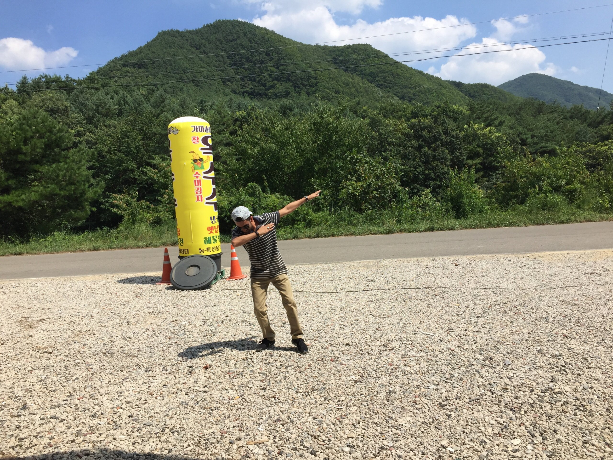

# Introduction - Saleem

Hello Plaifers, 살림살이 좀나아지셨습니까 나으리 ㅋㅋㅋ

I am Saleem Asghar and I am excited to be a part of this community. I have a strong passion for Machine Learning and I am constantly seeking opportunities to learn and grow in the field of ML/DL/Robotics and software development.

I am always eager to explore new technologies and frameworks.

Apart from sleeping and doing nothing, I am also interested in data analysis and machine learning. I believe that leveraging data can provide valuable insights and drive informed decision-making.

I am looking forward to collaborating with all of you and contributing to the success of this community. Feel free to reach out to me if you have any questions or if you'd like to work on any projects together.

And to all Plifers, I have a humble request: please teach me everything you know ㅋㅋㅋ, so I can become the ultimate coding ninja and impress my cat with my mad programming skills! Let's embark on this learning journey together and create something magical!🧙‍♂️✨

갑사합니다~ 잘 부탁드리게ㅆ습니다! 

